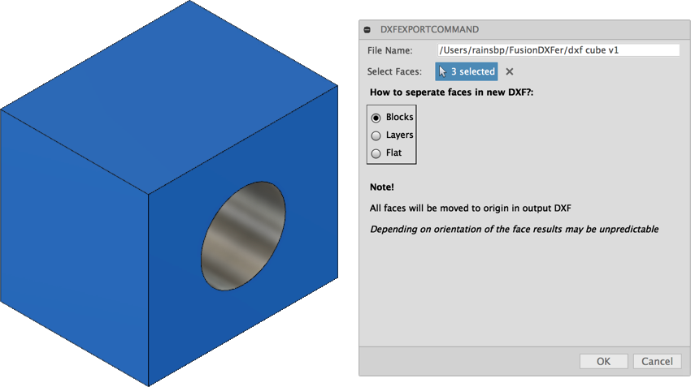

# Fusion 360 DXFer
Simple DXF Output of multiple Faces:

NOTE: This sample is provided "As-is" with no guarantee of performance, reliability or warranty.

Credit where credit is due!!!

This sample add-in is built upon the [ezdxf library](https://github.com/mozman/ezdxf/blob/master/docs/source/introduction.rst)

# Usage
Select multiple faces and export a single DXF

Note: All DXF objects will be moved to the orgin based on the face's orientation.
Note this may give somewhzt unpredictable results.
Modification will be likely necessary.

# Installation
Follow the [installation instructions here](https://tapnair.github.io/installation.html) for your particular OS version of Fusion 360

## License
Samples are licensed under the terms of the [MIT License](http://opensource.org/licenses/MIT). Please see the [LICENSE](LICENSE) file for full details.

## Written by

Written by [Patrick Rainsberry](https://twitter.com/prrainsberry)   (Autodesk Fusion 360 Business Development)

See more useful [Fusion 360 Utilities](https://tapnair.github.io/index.html)

